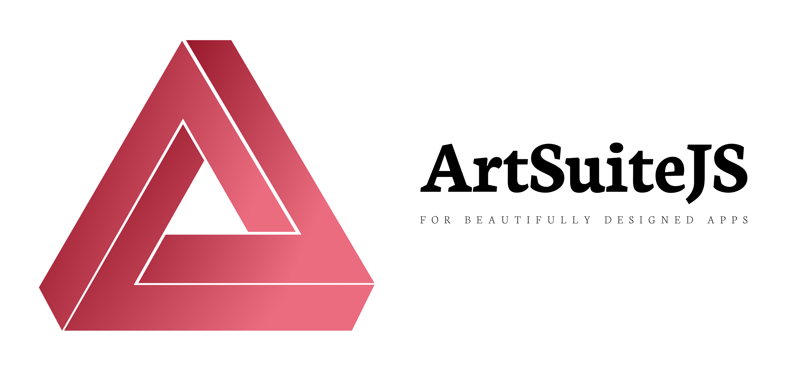

# ArtSuiteJS - for beautifully designed apps

We love beautifully designed apps. If you care about design as much as we do, you want a framework that not only provides exquisite defaults layouts and widgets for rapid prototyping, but also total, utter control down to the last pixel bringing your uncompromising vision to life.

The framework itself should be extremely well designed. Our number one design value is less is more. 

If your website has a login, has any dynamically generated web pages, or otherwise has a non-trivial amount of code, you are writing an app, not a collection of documents. HTML is an [flying-submarine](https://en.wikipedia.org/wiki/Flying_submarine). I.e, it's trying to do two things at the same time which are fundamentally different: be a document format and an app framework. It is impossible to do both those things well at the same time.

Enter ArtSuiteJS, a modern, clean, canvas and JavaScript-based framework for writing web-apps without HTML. Not only can you write full-featured, responsive web-apps with ease, you can also deploy high quality hybrid Android and iOS apps with 90%+ code reuse.

* what
* how
* why

[ZEN](http://www.essenceandartifact.com/2016/02/yagni-and-building-in-house-frameworks.html) Apps for Web and Mobile

### What is the ArtSuiteJS?

A collection of tools with two main goals:

1. One platform for Cloud-Enabled Apps across Web, Mobile-Web and 'native' Apps.
2. Maximize developer productivity.

Sub goals include:

* designer-oriented
* minimize code (measured in tokens)
* maximum extensibility at all levels
* built on ubiquitous standards (Javascript and HTMLCanvas)

### [The ArtSuite Wiki](https://github.com/imikimi/art-suite/wiki)

Go to the [Wiki](https://github.com/imikimi/art-suite/wiki) for documentation and more.

### Demos Live, on the Web

[Launch Art Suite Demos](http://imikimi.github.io/art-suite-demos/) ([github](https://github.com/imikimi/art-suite-demos))

You can also see an in-production application here: [imikimi.com](http://imikimi.com/). Click the "ADD MY PHOTOS" button. Click the "more" menu at the top and select "Kimi Frame Maker." The pop-over image editor is written 100% in ArtSuite.

### Documentation

The ArtSuite doc is on primarily on Github in the READMEs and wikis of each package. The documentation is far from complete, so you please also check out the many available examples. Also, all the ArtSuite packages are well tested. These tests are considered the definitive documentation, and, therefor, they are designed to be as readable as possible.

### ArtSuite Examples

The ArtSuiteDemos is an 

* [ArtSuiteDemos](https://github.com/imikimi/art-suite-demos) is an extensive and growing collection of demos showing off every aspect of the ArtSuite's UI aspects: ArtEngine, ArtReact and ArtFlux.
* [ArtSuiteTutorial](https://github.com/imikimi/art-suite-tutorial) is a multi-step tutorial showcasing how to build a working chat app, step by step.

### Write Your App

To get started writing your own app, use the [ArtBuildConfigurator](https://github.com/imikimi/art-build-configurator).
